# UDPT-Project - **Vaccine Reminder**

**Vaccine Reminder** là một đồ án của môn UDPT.

Thành viên:

**1312582 - Bùi Phạm Thiên Thư**

**1312595 - Trịnh Xuân Tiến**

**1312596 - Dương Tiễn**

**1312600 - Nguyễn Hoàng Tín**

URL: **...**

## Chức năng

Chức năng **bắt buộc**:
* [x] Đăng ký
    * [x] Email    
* [x] Đăng nhập
    * [x] Email    
    * [x] Google
    * [x] Facebook
* [x] Phân quyền
    * [x] Phụ huynh
    * [x] Quản lý
* [x] Chức năng của phụ huynh
    * [x] Quản lý trẻ
        * [x] Thêm trẻ
        * [x] Xóa trẻ
        * [x] Sửa thông tin trẻ
        * [x] Xem thông tin trẻ
    * [x] Xem lịch tiêm phòng của các trẻ đã thêm
    * [x] Đánh dấu các loại vaccine đã tiêm
    * [x] Nhận nhắc nhở tiêm phòng cho các trẻ đã thêm qua Email
    * [x] Thiết lập lựa chọn nhắc nhở
* [x] Chức năng của quản lý
    * [x] Thêm vaccine (Số mũi tiêm, giãn cách tiêm, thời gian tiêm, đối tượng tiêm)

* [x] Phát sinh lịch tiêm phòng

Chức năng **nâng cao* [ ]**:
* [ ] Đăng ký    
    * [ ] Số điện thoại
* [ ] Đăng nhập    
    * [ ] Số điện thoại        
* [ ] Phân quyền
    * [ ] Bác sĩ
* [ ] Chức năng của bác sĩ
    * [ ] Trả lời câu hỏi của phụ huynh
    * [ ] Xem thông tin của trẻ với sự cho phép của phụ huynh
* [ ] Chức năng của phụ huynh
    * [ ] Hỏi/đáp với bác sĩ
    * [ ] Xem thông tin vaccine.
    * [ ] Nhận nhắc nhở tiêm phòng cho các trẻ đã thêm qua tin nhắn điện thoại
* [x] Chức năng của quản lý
    * [x] Thêm thông tin vaccine (Thành phần, công dụng, tác dụng phụ)

## Wireframe
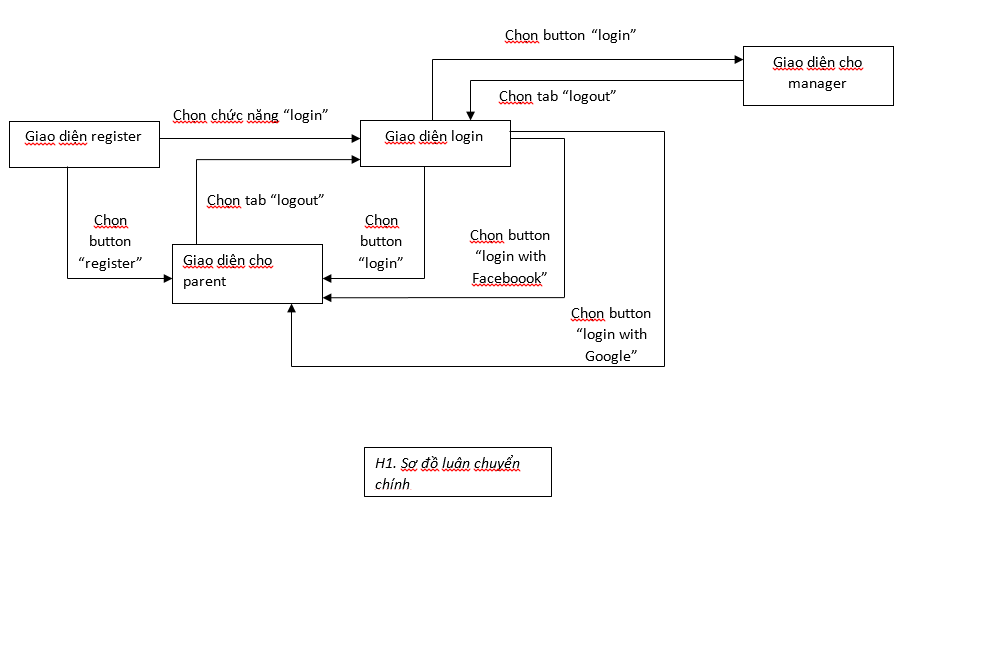

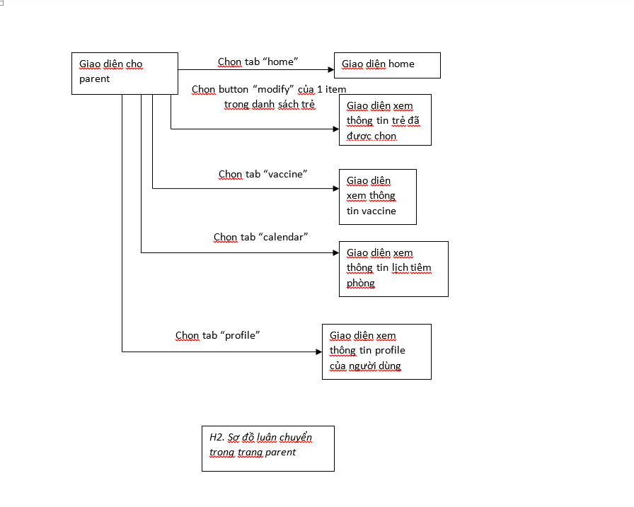

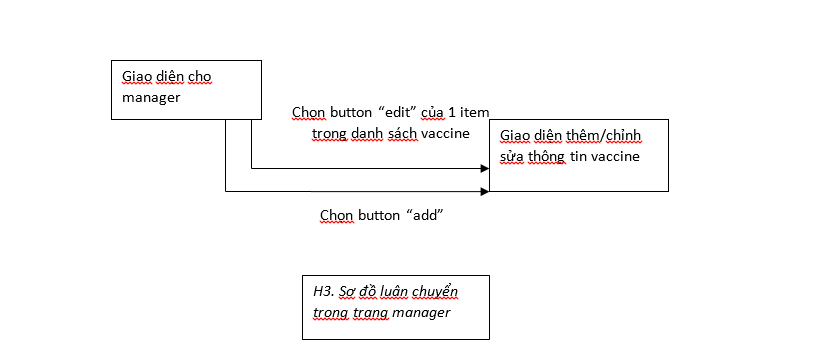

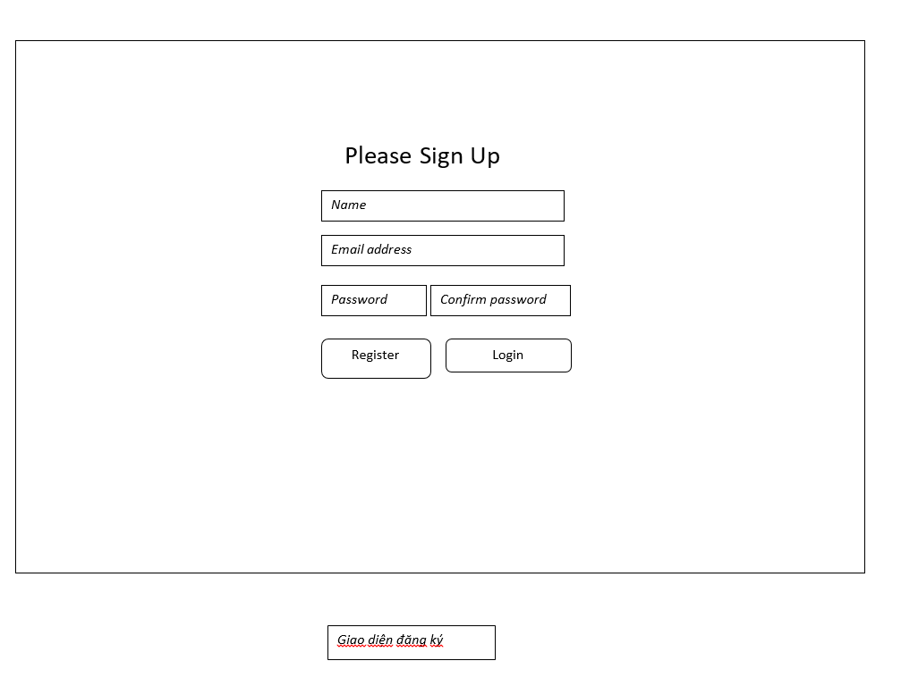

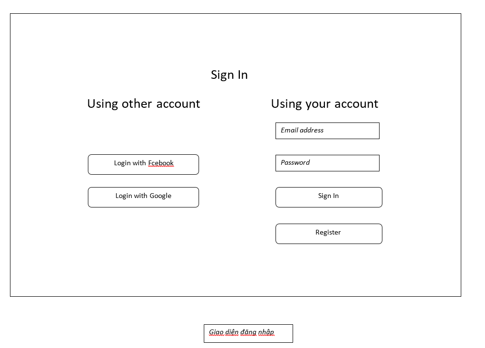

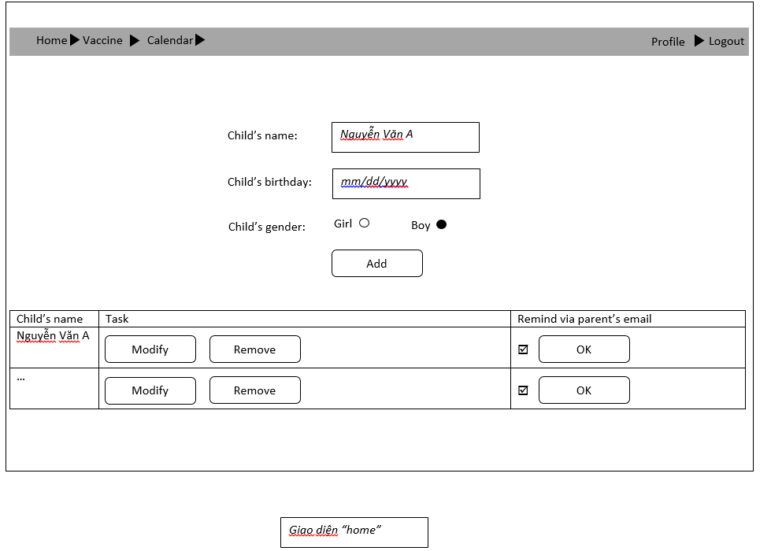

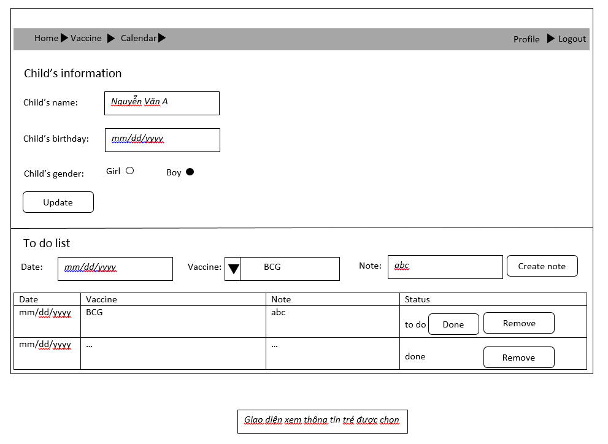

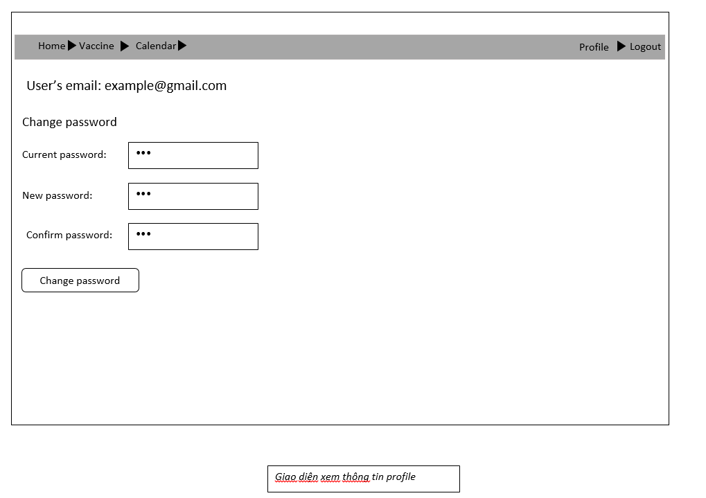

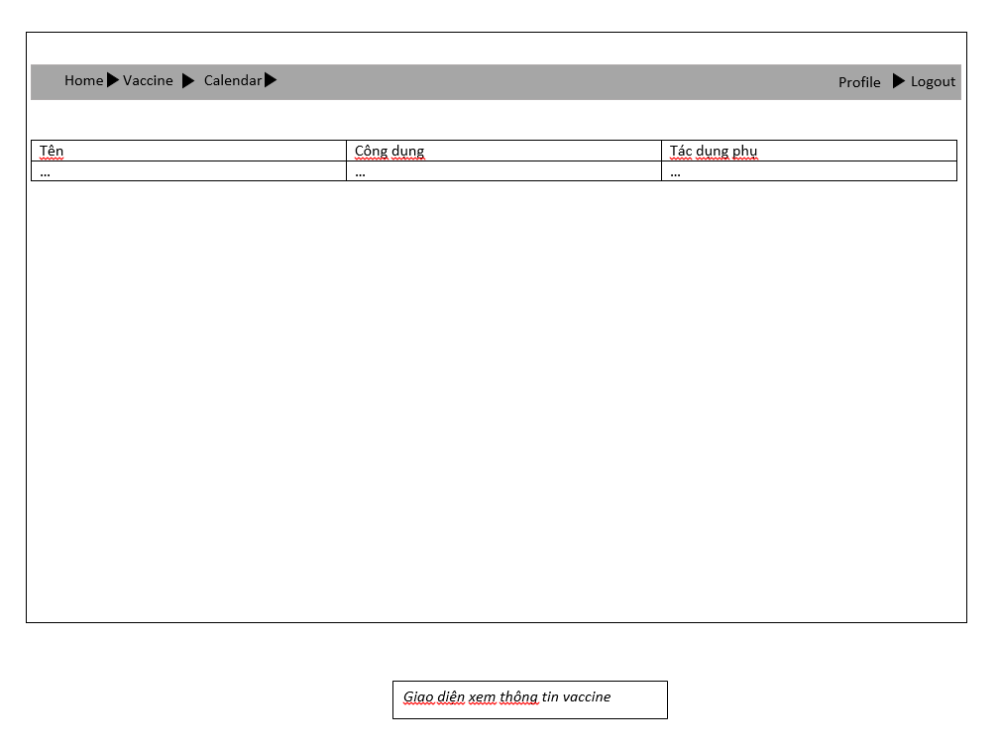

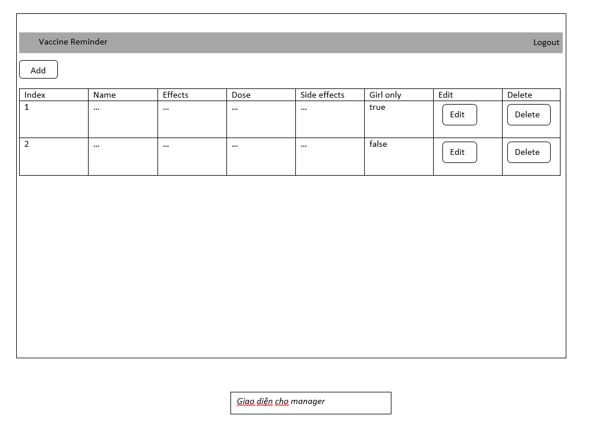

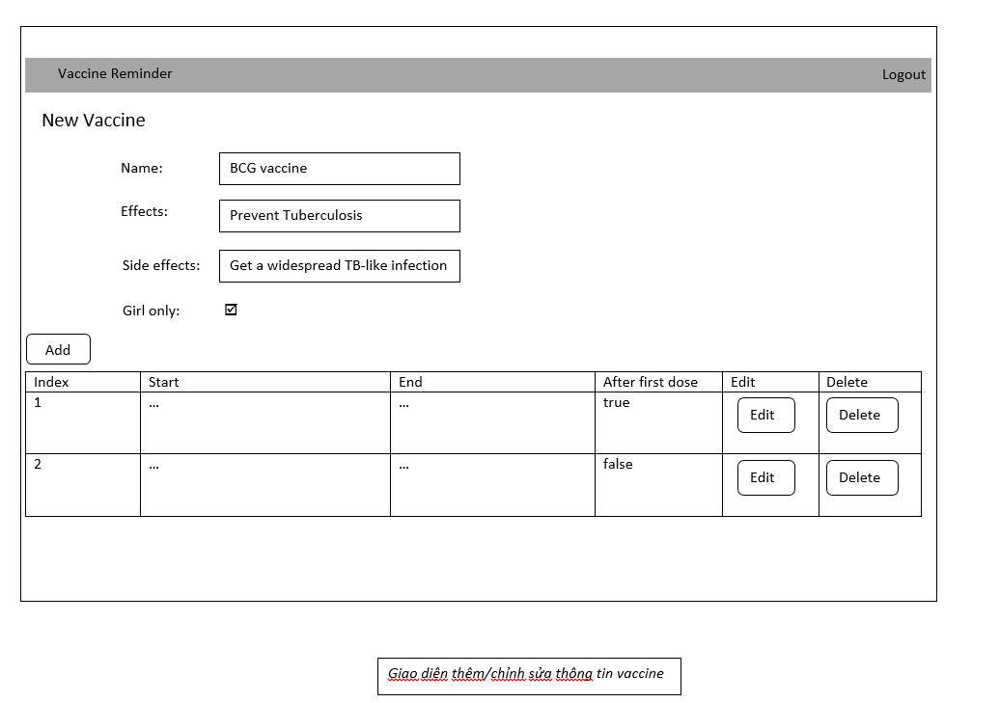

## Data Schema

## Chuẩn đầu ra đã đạt được
1. Bùi Phạm Thiên Thư

G1.2 		| G3.1	 		| G5.1			| G5.2			| G5.3 & G5.5	| G7.1			| G8.3
------------| ------------- | -------------	| ------------- | ------------- | ------------- | -------------
Sử dụng git theo gitflow workflow | Những xử lý liên quan đến dữ liệu cần được làm tại server để đảm bảo làm việc trên dữ liệu mới nhất. Đối với những button cần được dùng để post dữ liệu nhưng không nằm trong form, cần bắt sự kiện click button tại client và gọi hàm post để gọi xử lý tại server. Đối với chức năng thay đổi mật khẩu, ta có thể để server kiểm tra tính hợp lệ của mật khẩu hiện tại, sau đó kiểm tra mật khẩu mới với mật khẩu được xác nhận có trùng khớp hay không tại client, nhưng việc kiểm tra tại client được ưu tiên thực hiện trước để tăng tốc độ xử lý. | Thiết kế có sử dụng table, thiết kế với div, có sử dụng navigation, sidebar, có các icon, có sử dụng resposive (navigation bar cho thiết bị có màn hình landscape, sidebar cho thiết bị có màn hình portrait) 	| Sử dụng angular js, bootstrap js | Có làm và thao tác với cơ sở dữ liệu, có làm với kiến trúc MVC với angular js | Người dùng không được phép truy cập vào các trang không có quyền  |   Sử dụng jQuery, CSS framework (boostrap), Front-end framework (angular js 1)

3. Dương Tiễn

G1.2        | G3.1          | G5.1          | G5.2          | G5.3 & G5.5   | G5.4          | G8.3
------------| ------------- | ------------- | ------------- | ------------- | ------------- | -------------
Sử dụng git theo gitflow workflow | Sử dụng jQuery AJAX ở Register để kiểm tra thông tin đăng ký của người dùng để thông báo cho người dùng biết thông tin sai mà không cần phải reload lại trang, tạo sự thoải mái cho người dùng. Dùng AngularJS 1 để tải tất cả dữ liệu cần thiết cho trang manager vào lần đầu tiên và dùng AngularJS 1 Ajax để xử lý việc thêm và cập nhật thông tin vaccine, giúp người dùng thao tác nhanh hơn không phải reload lại trang khi cần chuyển đổi giữa các màn hình (Xem danh sách vaccine, thêm/cập nhật vacxin, thêm/cập nhật mũi tiêm của vacxin)  | Thiết kế responsive | Sử dụng AngularJS 1 | Có làm và thao tác CSDL | Lập trình AJAX với các callback success, error  |   AngularJS 1, Bootstrap 3, jQuery

